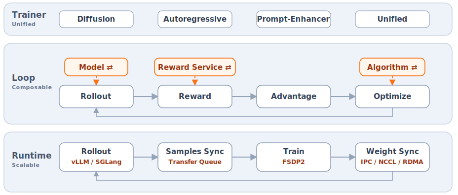

<div align="center">


### A Reinforcement Learning Framework for Unified Multimodal Models

**U**(you)·**ni**(need)·**RL** for unified multimodal intelligence

[](pyproject.toml)
[](LICENSE)
[](https://unirl-project.github.io/unirl/)
[](assets/wechat_qr.jpg)

</div>

## News

- **[2026-06]** 🔥  **UniRL** released! A unified RL framework for multimodal models.
- **[2026-05]** 🔥 **DRPO** released! "Rethinking the Divergence Regularization in LLM RL" ([arXiv](https://arxiv.org/abs/2606.09821)).
- **[2026-06]** 🔥 **Flow-DPPO** released! "Flow-DPPO: Divergence Proximal Policy Optimization for Flow Matching Models" ([paper](FlowDPPO/HY_FlowDPPO.pdf)).

## About

<div align="center">
  
</div>

UniRL runs one RL post-training loop across every multimodal model family.
What makes UniRL stand out:

**1. Unified**: a typed Segment contract abstracts latents and tokens alike, so one RL loop spans diffusion, autoregressive, prompt-enhancer, and unified models, where most RL stacks cover just one.

**2. Composable** : a typed Stage interface decouples loss from model, so one algorithm trains every same-modality model, and a new model inherits every algorithm.

**3. Scalable** : a typed engine interface decouples rollout from training, so one recipe scales from a single GPU to a high-throughput, disaggregated multi-node cluster.

See [`unirl/README.md`](unirl/README.md) for the code architecture.

## Getting Started

Set up an environment. One engine extra (`vllm` or `sglang`) provides torch and its CUDA stack, and the trainside quickstart runs on either:

```bash
uv venv --python 3.12 --seed .venv && source .venv/bin/activate
export VLLM_USE_PRECOMPILED=1   # else a 30+ min CUDA build
uv pip install -e ".[vllm,train,infer]"   # vllm = CUDA 12.9; for CUDA 13.0 use the [sglang,...] extra
```

Then compose-check and launch a single-node example:

```bash
python -m unirl.train_diffusion --config-name=diffusion/sd3_trainside --cfg job --resolve
bash examples/run_experiment_single_node.sh diffusion/sd3_trainside
```

See [`examples/README.md`](examples/README.md) for installation and the full launch guide.


## Support
**Algorithms.**
We highlight the algorithms proposed by our team. Each comes with a step-by-step tutorial! 🌟

- 🌟 **Flow-DPPO** : "Flow-DPPO: Divergence Proximal Policy Optimization for Flow Matching Models" ([paper](FlowDPPO/HY_FlowDPPO.pdf)). Tutorial in [FlowDPPO/](FlowDPPO/)!
- 🌟 **DRPO** : "Rethinking the Divergence Regularization in LLM RL" ([arXiv](https://arxiv.org/abs/2606.09821)). Tutorial in [DRPO/](DRPO/)!
- **GRPO** : PPO-clipped ratio, group-relative advantages.
- **FlowGRPO** : GRPO for flow-matching diffusion.
- **DiffusionNFT** : ratio-free, dual-adapter reconstruction.
- **DanceGRPO** : FlowGRPO variant.
- **MixGRPO** : FlowGRPO variant.

**Models.**
All listed models are supported.
- **Stable Diffusion 3 / 3.5** : Image diffusion, Text → Image.
- **Qwen-Image** : Image diffusion, Text → Image.
- **FLUX.2-Klein** : Image diffusion, Text → Image.
- **WAN 2.1** : Video diffusion, Text / Image → Video.
- **WAN 2.2** : Video diffusion, Text / Image → Video.
- **HunyuanVideo 1.0 / 1.5** : Video diffusion, Text → Video.
- **Qwen-VL** : Vision-language AR, Text + Image → Text.
- **Qwen3** : LLM AR, Text → Text.
- **Prompt-Enhancer** : LLM + diffusion, Text → Text → Image.
- **HunyuanImage3** : Unified AR + diffusion, Text → Image.
- **Bagel** : Unified AR + diffusion, Text → Image.

**Engines.**
Pick a rollout engine per recipe.
- **Trainside** : in-process direct sampling, no separate server or weight sync.
- **SGLang** : SGLang server, diffusion rollout.
- **SGLang-LLM** : SGLang (SRT) server, autoregressive text rollout.
- **vLLM-Omni** : vLLM-Omni server, unified models (HunyuanImage3).
- **Composed** : pairs an LLM and a diffusion engine for the prompt-enhancer flow.

**Deployment.**
Place rollout and training across GPUs.
- **Disaggregated** : rollout and training on separate GPU pools, weight sync required.
- **Colocated** : rollout and training share GPUs via offload/onload, weight sync required.

## Roadmap

We are actively expanding model and algorithm coverage. Near-term directions:

- Broaden algorithm coverage for the newer model families — FLUX.2-Klein,
  HunyuanVideo 1.0 / 1.5, and Bagel.
- Extend the team-proposed algorithms (Flow-DPPO, DRPO) to more model families.
- Broaden reward backends and rollout-engine coverage across domains.

Want a model or algorithm prioritized? [Open an issue](https://github.com/Tencent-Hunyuan/UniRL/issues) to discuss.

## Contributing

Contributions and questions are welcome. Before opening a pull request, read the
repository conventions in [`AGENTS.md`](AGENTS.md), run the
[pre-PR checks](examples/README.md#adding-or-editing-a-recipe) for the files you
touched, and fill in the [pull request template](.github/pull_request_template.md).
For questions, bug reports, and feature requests,
[open an issue](https://github.com/Tencent-Hunyuan/UniRL/issues).

## Acknowledgement

UniRL builds on ideas and infrastructure from the open-source RL and inference
ecosystem. We especially thank
[vLLM](https://github.com/vllm-project/vllm),
[SGLang](https://github.com/sgl-project/sglang),
[slime](https://github.com/THUDM/slime), and
[verl](https://github.com/volcengine/verl).

## Citation

If you find UniRL helpful, please cite:

```bibtex
@misc{unirl_github,
  title        = {{UniRL: A Reinforcement Learning Framework for Unified Multimodal Models}},
  author       = {Haonan Wang and Linyu Wu and Qian Qiu and Lewei Jin and Bowen Ping and Jianghai Chen and Yiheng Du and Guangxin He and Yu Shi and Yongguang Lin and Zhuoxin Zhou and Zhanchao Zhou and Keming Wu and Rizhen Hu and Xuefei Ning and Lvfang Tao and Feiyu Hu and Xiangyan Liu and Siqi Kou and Jiarui Yao and Xiangxin Zhou and Liefeng Bo and Wenxi Zhu and Tianyu Pang},
  year         = {2026},
  howpublished = {\url{https://github.com/Tencent-Hunyuan/UniRL}},
  urldate      = {2026-06-05}
}
```

If you use DRPO, please also cite:

```bibtex
@misc{yao2026drpo,
  title         = {{Rethinking the Divergence Regularization in LLM RL}},
  author        = {Jiarui Yao and Xiangxin Zhou and Penghui Qi and Wee Sun Lee and Liefeng Bo and Tianyu Pang},
  year          = {2026},
  eprint        = {2606.09821},
  archivePrefix = {arXiv},
  primaryClass  = {cs.LG},
  url           = {https://arxiv.org/abs/2606.09821}
}
```

If you use Flow-DPPO, please also cite:

```bibtex
@misc{ping2026flowdppo,
  title        = {{Flow-DPPO: Divergence Proximal Policy Optimization for Flow Matching Models}},
  author       = {Bowen Ping and Xiangxin Zhou and Penghui Qi and Minnan Luo and Liefeng Bo and Tianyu Pang},
  year         = {2026},
  howpublished = {\url{https://github.com/Tencent-Hunyuan/UniRL/tree/main/FlowDPPO}},
  note         = {Manuscript dated June 8, 2026}
}
```
