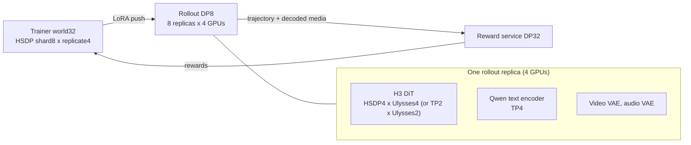

# MiniMax-H3 T2VA

MiniMax-H3 is a 33B dense omni-modal transformer that denoises video and stereo
audio jointly in one packed sequence.

| Recipe | GPUs | Rollout |
| --- | --- | --- |
| `minimax_h3_t2va_trainside` | 8 | in-process (trainside) |
| `minimax_h3_t2va_trainside_hsdp_2x8_validation` | 16 | in-process, HSDP trainer |
| `minimax_h3_t2va_nft` | 8 | in-process, DiffusionNFT |
| `minimax_h3_t2va_vllmomni_2x4_timeshare` | 8 | vLLM-Omni, 2 replicas x 4 GPUs |
| `minimax_h3_t2va_vllmomni_32c_8x8` | 32 | vLLM-Omni, 8 replicas x 4 GPUs (lifecycle gate) |
| `minimax_h3_t2va_vllmomni_32c_quality100` | 32 | same, 100-step quality run |
| `minimax_h3_t2va_vllmomni_32c_quality100_tp2_up2` | 32 | same, DiT TP2 x Ulysses2 replicas |

The `vllmomni` recipes inherit model, mixed-dtype, LoRA, CPS kernel and replay
settings from `minimax_h3_t2va_trainside`; they only swap the rollout engine
and the deployment.

## vLLM-Omni deployment

Trainer, rollout and reward time-share the same GPUs (`layout: colocate`,
`train_resident: false`, `rollout.config.enable_sleep_mode: true`). Each phase
order is: push LoRA to the replicas → rollout wakes and generates video, audio
and a sparse FP32 trajectory → rollout sleeps, reward scores → trainer replays,
backwards and steps.

- **Replica.** `rollout.config.tp_size: 4` groups four rollout ranks into one
  engine: rank 0 boots vLLM-Omni over the group's GPUs and the other three are
  idle shells. The per-replica layout lives in
  `unirl/rollout/engine/vllm_omni/deploy_configs/minimax_h3_t2va_rl.yaml`;
  `rollout.config.omni_extra` overrides it per recipe.
- **LoRA.** The trainer's Diffusers-layout adapter is renamed onto the serving
  DiT (`to_out.0` → `out_proj`, `ff.net.2` → `mlp.fc2`) and the fused SwiGLU
  `ff.net.0.proj` is split into `mlp.gate_proj` / `mlp.up_proj` sublayers of the
  fused `mlp.fc1`. The rollout pipeline fails the request if any adapter module
  is left unbound, so a layout mismatch cannot silently serve base weights.
  `sync.verify` is off because the trainer-side checksums describe the
  pre-remap layout.
- **Reward.** With 8 prompts and reward DP32, `reward_dispatch: row` scatters
  generated rows instead of whole prompt trees; scorers then see per-row
  sample/group ids.
- **Parity.** `quality100` sets `algorithm.max_rollout_replay_logp_absdiff`:
  once per batch, before the update, trainer replay must reproduce the rollout
  engine's log-probs within `1e-3`.

## Measured on the previous engine build

These numbers predate the vLLM-Omni 0.28 port (256x448x107, 8 prompts x 8
samples, 24 transitions, eta 0.6, PickScore only) and should be re-measured.

| Rollout topology | median generate | peak memory | max parity drift |
| --- | --- | --- | --- |
| HSDP4 + UP4 | 112.697 s | 66,876 MiB | 3.73e-5 |
| TP2 x UP2 | 91.087 s | 77,436 MiB | 3.94e-5 |

**Reward convergence is still open.** No H3 recipe here has produced a
sustained rise in held-out visual reward; a Wan2.1 trainside control on the
same trainer, PickScore and GRPO path does rise (`0.6985 → 0.7201` over 20
rollouts). Treat these files as infrastructure, not a tuned recipe.

## Geometry

`MiniMaxH3Geometry.resolve` enforces the structural constraints: both axes a
multiple of 32, aspect ratio within 1:4–4:1, area at most 768x1344, and a
duration and frame count that round-trip through the VAE (`17n + 5` pixel
frames, at least 5 s at 24 fps — 124 frames is the shortest legal clip).

## Known limitations

- Rollout siblings are serial: the adapter issues one request per sibling, so
  doubling samples per prompt roughly doubles generate time.
- Trajectories, reward media and reward rows travel through the driver rather
  than rollout-worker to reward-worker transfer.
- Trainer replay keeps every selected step in one autograd graph even at
  micro-batch 1, which bounds how many SDE steps fit on an H20.
