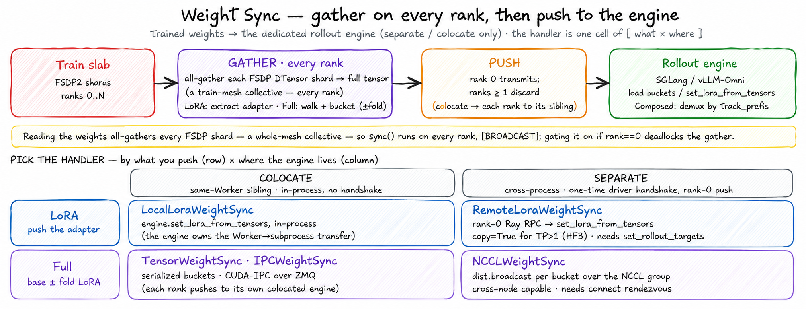

# Weight Sync

> **Where it fits:** the *sync* back-edge of the loop (dedicated modes only) —
> rollout → reward → advantage → train → **sync**. In: trained weights from the
> backend. Out: weights pushed into the rollout engine.
> Full map: [`../../README.md`](../../README.md).

  

*Every `sync()` is the same two phases — **gather** the weights (an all-gather, so it runs on **every train rank**) then **push** into the engine — and the six handlers select by weight kind, placement, engine, and transport.*

## What it is

`unirl.distributed.weight_sync` delivers freshly-trained weights from the train
slab into the dedicated rollout engine(s). It is the dashed back-edge of the
training loop, and it exists **only** when rollout runs on a dedicated engine
(direct vLLM / SGLang / vLLM-Omni, in `separate` or `colocate` layouts); direct sampling (the
trainside engine) needs no sync because it samples the live training weights
in-process.

## Why it exists

The non-obvious cost: pushing weights from an FSDP model is **not** a rank-0
operation, even though only rank 0 transmits. *Reading* the weights
(`extract_lora_tensors` for LoRA, `_to_full_tensor` for full) redistributes every
FSDP `DTensor` shard to `Replicate` — a collective the whole train mesh must enter
in lockstep. So every handler runs as a `BROADCAST`-dispatched `sync()`: ranks ≥1
drive their half of the all-gather and discard, rank 0 alone transmits. That is why
this is a sibling `Remote` family and not a rank-0 helper — and why gating the push
on `if rank == 0` deadlocks the gather. The transport fan-out (LoRA vs full;
NCCL / IPC / serialized; colocate vs cross-node) then rides on that one shared
materialization.

## How it works

- **Two families, picked by `_target_`.** *LoRA* (`lora/`) extracts the trained
  adapter and loads it via the engine's `set_lora_from_tensors`. *Full-weight*
  (`full/`) materializes the full base weights (optionally with LoRA folded in) and
  streams them in buckets.
- **`sync()` is a train-mesh collective.** Extracting weights redistributes each
  FSDP `DTensor` shard to a full tensor — a collective every train rank must run —
  so `sync()` is dispatched `BROADCAST`. Only the *push* is rank-0 (for NCCL and
  Remote-LoRA); ranks ≥1 run the all-gather and discard.
- **Transports.** LoRA: `LocalLoraWeightSync` (colocate, in-process sibling) and
  `RemoteLoraWeightSync` (cross-slab rank-0 Ray push). Full: `NCCLWeightSync`
  (separate slabs, cross-node capable), `TensorWeightSync` (colocate serialized
  handoff), `IPCWeightSync` (colocate CUDA-IPC over ZMQ). Colocate handlers take the
  engine as a same-Worker sibling; separate/NCCL need a one-time driver handshake.
- **Direct-vLLM full weights need a topology-specific path.**
  `FSDPVLLMFullWeightSync` is the target for an FSDP actor feeding a
  vLLM TP engine. It is not interchangeable with `TensorWeightSync`: every vLLM
  TP worker receives the same full tensor and its model loader performs the TP
  shard. All actor ranks enter each FSDP materialization; only global rank 0
  holds one CPU bucket and writes it to disk. Publication is accepted only after
  every worker returns consumed-name, loaded-model coverage, and
  committed-version receipts.
- **Routing.** `param_prefix` prepends the model's canonical key prefix;
  `track_prefix` further prefixes so a `ComposedRolloutEngine` can demux the update
  to one child (PE registers one handler per track).

The one bit-equality safety net is the LoRA `verify` checksum read-back — but it is
vLLM-Omni-only, so SGLang LoRA runs have none.

**Extending it:** a new transport subclasses `LoraWeightSyncBase` or
`FullWeightSync` (the FSDP→full materialization, bucketing, and `name_remap` are
already done), implements `sync()` as `BROADCAST` shipping each bucket, and adds the
matching receiver on the engine side (`../../rollout/engine/`).

## Gotchas

- **`sync()` is a train-mesh collective** — the FSDP→full materialization runs on
  *every* train rank; never gate it behind `if rank == 0`. Only the push is rank-0 —
  and with a TP>1 rollout engine the push owner is each group's `tp_rank == 0`, not
  global rank 0, because that is the rank hosting the server.
- **FSDP rank is not vLLM TP rank.** Do not derive vLLM payload fan-out from the
  train mesh or reuse a payload with `rank % len(payloads)`. The dedicated path
  must assert TP cardinality, reject missing/unexpected/duplicate tensor names,
  and require all TP workers to report one committed model version before it
  publishes a successful receipt.
- **Staging must remain bucket-bounded.** A 30B BF16 model cannot be accumulated
  as a complete CPU copy on every FSDP rank. The direct-vLLM path keeps host RAM
  to one materialized bucket on rank 0, while the staging filesystem holds the
  complete publication (roughly 60 GiB for 30B BF16, plus serialization
  overhead) until push. Before materialization it checks `psutil` available
  memory and filesystem free space; optional `host_memory_budget_mb` and
  `staging_disk_budget_mb` make stricter limits explicit.
- **A bucket is a versioned transaction.** Its header carries protocol,
  `sync_id`, bucket index/count, `model_version`, a metadata fingerprint, and
  every tensor's name/shape/dtype/numel/SHA-256. Payload cardinality must equal
  rollout TP exactly; modulo reuse is forbidden. The final model version is
  committed on every TP worker before prefix-cache reset, and generation resumes
  only after both operations are confirmed.
- **`transfer_queue` is not weight sync** — that's the rollout→trainer data plane
  for bulky rollout outputs (segments, conditions, decoded media); weight sync is
  trainer→rollout. Don't conflate them.
- **`param_prefix` mismatch silently corrupts the load** (wrong/zero layers) —
  `verify` is designed to catch it, but it's vLLM-Omni-only and off by default, so
  most runs have no net at all.
- **`RemoteLoraWeightSync` with `copy=False` breaks on TP>1 engines** — the zero-copy
  adapter handle carries a one-shot file descriptor consumed by the first worker, so
  the `collective_rpc` broadcast to ranks 2..N gets a dead handle (HI3). Set
  `copy=True` for any TP>1 stage; `copy=False` is only safe for a TP=1 separate slab (SD3).
- **`CheckpointWeightSync.version` is a filename sequence**, not a receiver
  idempotency key. Other transports carry no independent version ledger.
