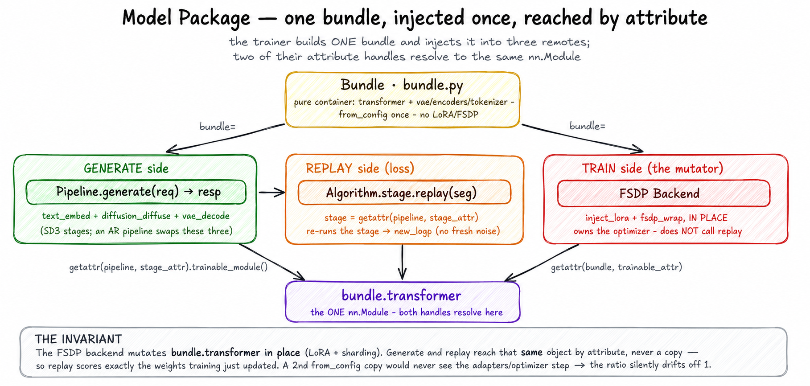

# Model Code Packages

> **Where it fits:** cross-cutting — the model code that both the *rollout* step
> (`pipeline.generate`) and the *train* step (`stage.replay`) run, on one shared set
> of weights. Full map: [`../README.md`](../README.md).

  

*The one idea that makes UniRL's RL correct: the **stage** runs the rollout forward (`diffuse` / `autoregress`) and the train forward (`replay`) over the **same** `bundle.transformer` — the one the FSDP backend mutates in place — so new_logp and old_logp land on identical, just-updated weights.*

## What it is

`unirl/models/` holds one self-contained subpackage per model (`sd3/`, `qwen3/`,
`hunyuan_image3/`, `pe/`, …). Each implements the shared **bundle / pipeline /
stage / conditions** contract so the same model code, on the same weights, serves
*both* the rollout engine (generate) and the train stack (replay).

> Not to be confused with the repository-root `models/` directory, which only holds
> local checkpoint and reward-model symlinks.

## Why it exists

Rollout and training must score the *same* weights or the GRPO ratio is
meaningless — and "same weights" is subtle, because the FSDP backend mutates
`bundle.transformer` **in place** (LoRA injection, FSDP sharding). The package is
built so both sides reach that one mutated object *by attribute* — the backend
wraps `bundle.<trainable_attr>`, the engine evals
`pipeline.<stage_attr>.trainable_module()` — instead of holding a private copy.
That is the real reason a bundle is bare modules with no lifecycle logic: a
self-loaded second copy (`from_config`) would never see the adapters or the
optimizer step, so replay would silently score stale weights and the ratio would
drift off 1.0 with no error. (The uniform contract across SD3 / Qwen3 / HunyuanImage3
is the secondary payoff — one backend drives them all by attribute name.)

## How it works

A model package bridges three concerns through one shared bundle:

- **Bundle** (`bundle.py`) — a pure container of weights + tokenizer/scheduler,
  loaded by `from_config`. No lifecycle logic. The biggest models (HunyuanImage3,
  Bagel) add a `from_meta_config` + `materialize()` path so each rank loads only its
  shard of the large transformer; SD3 / Qwen3 load eagerly.
- **Pipeline** (`pipeline.py`) — the endomorphic generate entrypoint
  (`generate(sample) -> sample`): it reads ancestor primitives through
  `sample.conditioning()`, reads sampling params from a pre-forked generation
  Part, builds typed `Conditions`, runs the stage, and fills that Part.
- **Stages** (`diffusion.py` / `ar.py`) — the trainable units. `DiffusionStage`
  exposes `diffuse` (rollout), `replay` (train), and `predict_noise_at_step` (DiffusionNFT);
  `ARStage` exposes `autoregress` and `replay`. Each exposes `trainable_module()`,
  returning the `nn.Module` the FSDP backend wraps and engines eval-scope.
- **Conditions** (`conditions.py`) — typed `Batch` subclasses with
  `from_dict`/`to_dict`, so the pipeline works in typed form internally but stores
  the generic `Dict[str, Condition]` shape on the generated Part.

The **bundle is shared, not duplicated**: the trainer builds it once and injects it
into both sides, so replay reads exactly the weights training updates — hence
pipelines offer a bundle-injected constructor alongside the self-loading
`from_config`. σ is engine-pinned: a diffusion pipeline reads the generation
Part's `DiffusionSamplingParams.sigmas` verbatim
and raises if it's `None` — it doesn't compute σ at generate time. Diffusion
pipelines also implement `latent_shape()` so the trainer can author the
byte-identical `x_T` recipe.

**Extending it:** a new model is a new `unirl/models/<model>/` with
`config.py` / `bundle.py` / `diffusion.py`|`ar.py` / `conditions.py` / `pipeline.py`
mirroring an existing one — there is no registry, models are selected purely by
`_target_`. **Read `.claude/skills/development/add-model-bundle/SKILL.md` first** —
it is the authoritative bundle / pipeline / stage / conditions contract.

## Gotchas

- **`trainable_module()` is on the stage, not the bundle.** The backend reaches the
  model via `getattr(bundle, trainable_attr)`; engines via
  `getattr(pipeline, stage_attr).trainable_module()`. Keep both pointing at the same
  module.
- **Bundles must stay pure containers** — no LoRA, FSDP, autocast, or weight-sync
  logic; those are train-side lifecycle concerns.
- **Share one bundle.** For colocate/trainside runs the pipeline must be built from
  the *injected* bundle (not `from_config`), or replay reads a stale second copy of
  the weights.
- **σ is engine-pinned** — a diffusion pipeline reads the generation Part's sigmas and raises if
  it's `None`; never build the σ tensor inside `generate`.
- **CFG empty-negative differs per model** (SD3 `""`, Qwen-Image `" "`) — use the
  model's canonical upstream value or the rollout/replay ratio drifts off 1.0.
- **HunyuanVideo-1.5 prompt-template whitespace is tokenizer state.** Keep
  `PROMPT_TEMPLATE_SYSTEM_MESSAGE` byte-identical to upstream because
  `mllm_crop_start=108` is tied to that exact prefix length; collapsing its
  indentation drops user-prompt tokens.
- **Work that needs real storage goes through `types/post_materialize.py`.** A
  bundle or a structural injector (LoRA / NFT / mirror) may run while the module
  is still on the meta device, where writing a tensor is a no-op. Register such
  work with `defer_after_materialize`; the train backend drains it with
  `apply_deferred_ops` after the weight load. The pair describes
  model-construction state, not training policy, which is why it lives under
  `models/types/` and not under `train/`.
- **Name-keyed matching around materialization compares canonical names.**
  Deferred ops (and `materialize()`) run post-wrap, and `checkpoint_wrapper`
  (activation checkpointing) interposes a `_checkpoint_wrapped_module.` segment
  in `named_parameters()` names while `state_dict()` keys stay canonical (the
  wrapper's state-dict hooks strip it). Any match between module params and
  checkpoint keys goes through `canonical_param_name`, exported beside the
  deferred-op pair in `types/post_materialize.py`.

## Conversation composition

`unirl/models/types/conversations.py` holds the transpose helpers with more than
one model consumer: `build_text_messages` (qwen3, qwen3_5),
`build_vision_messages` (qwen_vl, qwen3_5), and the two composition rules both
use — `system_prefix` and `group_consecutive_roles`. The sglang wire render
imports those two rather than keeping private copies, so the rules have one
definition.

- **One system rule:** the config `system_instruction` is a default; an explicit
  `system` turn in the data wins. A path that wants "data is the sole source of
  truth" leaves `system_instruction` unset in the recipe — not a code branch.
- **A render with one model consumer stays in that model's package** and imports
  the shared rules (Qwen3-Omni's URI-media render lives in
  `unirl/models/qwen3_omni/media.py`, next to the media contract it enforces). It
  moves into the shared layer when a second consumer actually exists.
- Model chat stages own *encoding* — chat template, processor, Bagel splits —
  never the composition rules.

## Support matrix

Model and algorithm support are independent dimensions (see
[`../algorithms/README.md`](../algorithms/README.md)); this table is the model
dimension. A row is **runnable** only when the package *and* a recipe under
[`examples/`](../../examples/README.md) exist for the listed entrypoint and rollout
engine — a package existing by itself is not evidence of end-to-end support. The Model
column lists the `pretrained_model_ckpt_path` defaults of the listed recipes, not
marketing aliases; where a recipe has no Hub default, it names the env var to set
and the checkpoint it expects, and the row is tagged checkpoint-path-required. Engines: `trainside` = in-process rollout on the training
weights; `sglang` / `sglang_diffusion` / `vllm` / `vllm_omni` / `fastvideo` =
external engines with a UniRL adapter (see
[`../rollout/engine/README.md`](../rollout/engine/README.md)).

**Status legend**

| Status | Meaning |
|---|---|
| ✅ Runnable | Package + at least one recipe for every listed entrypoint / engine. |
| 🧪 SFT-only | `train_sft` only; the pipeline has no `generate`, so no RL rollout path. |
| 🧩 Bundle-only | Package ships a bundle but no pipeline; usable only under another package's pipeline, as the listed recipe does. |
| 🔗 Composed | No weights of its own; composes other rows' packages. |

**Restriction tags**

- *engine-specific* — only the listed engines have a recipe; other engines have no adapter or no recipe and are unverified.
- *scorer-dependent* — the recipe's reward does not run from the base install alone. It needs a remote scorer served by [`unirl-reward-service`](../../unirl-reward-service/) through `RemoteRewardBackend` (e.g. `editreward`, `wise`, `geneval`, the `hpsv2` / `pickscore` / `hpsv3` / … bundle), a judge process in its own venv through `ManagedScorerProcessBackend` (`editscore`), an external judge endpoint (`llm_judge` → `$JUDGE_URL`), or a local scorer with its own install or checkpoint: `hpsv3` / `hpsv3pp` (`hpsv3` package), `ocr` (`[eval]` extra), `videoalign` (`VIDEOALIGN_CKPT`), `imagebind` (git install, CC-BY-NC-SA). Local scorers that only pull Hugging Face weights through `transformers` (`pickscore`, `clip`, `clap`, `videopickscore`, `videoclipdelta`) do not count. Registry: [`../reward/local/registry.py`](../reward/local/registry.py).
- *multi-node* — the recipe's launch topology is `NxM` with N ≥ 2 nodes.
- *LoRA-only* — every shipped recipe injects LoRA; full fine-tuning has no recipe.
- *checkpoint-path-required* — the recipe has no Hugging Face default; set `PRETRAINED_MODEL` (or the named env var).

### Image diffusion

| Package | Model (recipe default) | Modality | Entrypoints | Engines with a recipe | Recipes | Restrictions | Status |
|---|---|---|---|---|---|---|---|
| [`sd3/`](sd3/) | `stabilityai/stable-diffusion-3.5-medium` | Text → Image | `train_diffusion`, `train_sft`, `train_pe` (image side) | trainside, sglang_diffusion, vllm_omni | [`sd3_trainside`](../../examples/diffusion/sd3/sd3_trainside.yaml), [`sd3_nft_sglang`](../../examples/diffusion/sd3/sd3_nft_sglang.yaml), [`sd3_vllmomni`](../../examples/diffusion/sd3/sd3_vllmomni.yaml), [`sft/sd3_sft_lora`](../../examples/sft/sd3_sft_lora.yaml) | `sd3_dancegrpo_hpsv3*`, `sd3_nft_reward_service`, `sd3_opd_multi_teacher`: scorer-dependent | ✅ |
| [`qwen_image/`](qwen_image/) | `Qwen/Qwen-Image` | Text → Image | `train_diffusion` | trainside, sglang_diffusion, vllm_omni | [`qwen_image_trainside`](../../examples/diffusion/qwen_image/qwen_image_trainside.yaml), [`qwen_image_sglang`](../../examples/diffusion/qwen_image/qwen_image_sglang.yaml), [`qwen_image_grpo_vllmomni`](../../examples/diffusion/qwen_image/qwen_image_grpo_vllmomni.yaml) | — | ✅ |
| [`qwen_image_edit_plus/`](qwen_image_edit_plus/) | `Qwen/Qwen-Image-Edit-2511` | Text + Image → Image | `train_diffusion` | trainside, sglang_diffusion | [`qwen_image_edit_plus_nft`](../../examples/diffusion/qwen_image_edit_plus/qwen_image_edit_plus_nft.yaml), [`qwen_image_edit_plus_flowgrpo_sglang`](../../examples/diffusion/qwen_image_edit_plus/qwen_image_edit_plus_flowgrpo_sglang.yaml) | engine-specific (no vllm_omni adapter); `*_managed_editscore`: scorer-dependent | ✅ |
| [`flux2_klein/`](flux2_klein/) | `black-forest-labs/FLUX.2-klein-base-4B` / `-9B` | Text → Image; Text + Image → Image | `train_diffusion` | trainside, sglang_diffusion | [`flux2_klein_trainside`](../../examples/diffusion/flux2_klein/flux2_klein_trainside.yaml), [`flux2_klein_sglang`](../../examples/diffusion/flux2_klein/flux2_klein_sglang.yaml), [`flux2_klein_4b_editreward`](../../examples/diffusion/flux2_klein/flux2_klein_4b_editreward.yaml) | engine-specific; edit (`*_editreward*`) recipes: scorer-dependent | ✅ |
| [`z_image/`](z_image/) | `Tongyi-MAI/Z-Image` | Text → Image | `train_diffusion` | trainside, sglang_diffusion | [`z_image_trainside`](../../examples/diffusion/z_image/z_image_trainside.yaml), [`z_image_sglang_full_tensor`](../../examples/diffusion/z_image/z_image_sglang_full_tensor.yaml) | engine-specific | ✅ |
| [`boogu_image/`](boogu_image/) | `Boogu/Boogu-Image-0.1-Base` | Text → Image | `train_diffusion` | trainside | [`boogu_image_trainside`](../../examples/diffusion/boogu_image/boogu_image_trainside.yaml) | engine-specific (trainside only) | ✅ |

### Video diffusion

| Package | Model (recipe default) | Modality | Entrypoints | Engines with a recipe | Recipes | Restrictions | Status |
|---|---|---|---|---|---|---|---|
| [`wan21/`](wan21/) | `Wan-AI/Wan2.1-T2V-1.3B-Diffusers`, `Wan-AI/Wan2.1-I2V-14B-720P-Diffusers` (I2V) | Text → Video; Image → Video | `train_diffusion`, `train_sft` | trainside, sglang_diffusion, fastvideo | [`wan21_t2v`](../../examples/diffusion/wan21/wan21_t2v.yaml), [`wan21_i2v`](../../examples/diffusion/wan21/wan21_i2v.yaml), [`wan21_t2v_sglang`](../../examples/diffusion/wan21/wan21_t2v_sglang.yaml), [`wan21_t2v_dancegrpo_fastvideo`](../../examples/diffusion/wan21/wan21_t2v_dancegrpo_fastvideo.yaml), [`sft/wan21_t2v_ucf101_full`](../../examples/sft/wan21_t2v_ucf101_full.yaml) | `wan21_t2v_videoalign_dancegrpo`: scorer-dependent; fastvideo needs the `[fastvideo]` extra | ✅ |
| [`wan22/`](wan22/) | `Wan-AI/Wan2.2-T2V-A14B-Diffusers`, `Wan-AI/Wan2.2-I2V-A14B-Diffusers` (I2V) | Text → Video; Image → Video | `train_diffusion` | trainside, sglang_diffusion, fastvideo | [`wan22_t2v_14b`](../../examples/diffusion/wan22/wan22_t2v_14b.yaml), [`wan22_i2v`](../../examples/diffusion/wan22/wan22_i2v.yaml), [`wan22_t2v_14b_sglang`](../../examples/diffusion/wan22/wan22_t2v_14b_sglang.yaml), [`wan22_t2v_14b_dancegrpo_fastvideo`](../../examples/diffusion/wan22/wan22_t2v_14b_dancegrpo_fastvideo.yaml) | extends `wan21/` (dual-expert) | ✅ |
| [`wan22_v2v/`](wan22_v2v/) | `PRETRAINED_MODEL` → `Wan-AI/Wan2.2-T2V-A14B-Diffusers` (V2V pipeline over `wan22/`) | Video → Video | `train_diffusion` | trainside | [`wan22_v2v_14b`](../../examples/diffusion/wan22_v2v/wan22_v2v_14b.yaml) | engine-specific (trainside only); checkpoint-path-required (default is a cluster path); `videoclipdelta` scorer | ✅ |
| [`hunyuan_video10/`](hunyuan_video10/) | `hunyuanvideo-community/HunyuanVideo` | Text → Video | `train_diffusion` | trainside, sglang_diffusion | [`hunyuan_video10_t2v_trainside`](../../examples/diffusion/hunyuan_video10/hunyuan_video10_t2v_trainside.yaml), [`hunyuan_video10_t2v_sglang`](../../examples/diffusion/hunyuan_video10/hunyuan_video10_t2v_sglang.yaml) | engine-specific | ✅ |
| [`hunyuan_video15/`](hunyuan_video15/) | `hunyuanvideo-community/HunyuanVideo-1.5-Diffusers-480p_t2v` | Text → Video | `train_diffusion` | trainside, vllm_omni | [`hunyuan_video15_t2v_dancegrpo_trainside`](../../examples/diffusion/hunyuan_video15/hunyuan_video15_t2v_dancegrpo_trainside.yaml), [`hunyuan_video15_t2v_vllmomni_colocate`](../../examples/diffusion/hunyuan_video15/hunyuan_video15_t2v_vllmomni_colocate.yaml) | engine-specific (no sglang_diffusion adapter) | ✅ |
| [`ltx2/`](ltx2/) | `Lightricks/LTX-2` | Text → Video | `train_diffusion` | trainside, sglang_diffusion | [`ltx2_t2v_trainside`](../../examples/diffusion/ltx2/ltx2_t2v_trainside.yaml), [`ltx2_t2v_sglang_loramerge`](../../examples/diffusion/ltx2/ltx2_t2v_sglang_loramerge.yaml) | engine-specific; I2V is in the config but has no recipe (not claimed) | ✅ |
| [`ltx2/`](ltx2/) | `dg845/LTX-2.3-Diffusers` | Text → Audio + Video | `train_diffusion` | trainside | [`ltx2_3_t2av_trainside`](../../examples/diffusion/ltx2/ltx2_3_t2av_trainside.yaml), [`ltx2_3_t2av_audioreward_trainside`](../../examples/diffusion/ltx2/ltx2_3_t2av_audioreward_trainside.yaml) | engine-specific (trainside only); `*_audioreward*`: `t2av_composite` (`videopickscore` + `clap`), `imagebind` opt-in (scorer-dependent) | ✅ |
| [`minimax_h3/`](minimax_h3/) | `PRETRAINED_MODEL` (no default) → MiniMax-H3 (33B dense) Hub id or local snapshot | Text → Video + Audio | `train_diffusion` | trainside, vllm_omni | [`minimax_h3_t2va_trainside`](../../examples/diffusion/minimax_h3/minimax_h3_t2va_trainside.yaml), [`minimax_h3_t2va_nft`](../../examples/diffusion/minimax_h3/minimax_h3_t2va_nft.yaml), [`minimax_h3_t2va_vllmomni_2x4_timeshare`](../../examples/diffusion/minimax_h3/minimax_h3_t2va_vllmomni_2x4_timeshare.yaml) | engine-specific (no sglang_diffusion adapter); vllm_omni rollout uses four-GPU engine replicas; checkpoint-path-required; 1 node × 8 GPUs minimum; reward is `t2av_composite` (`videopickscore` + `clap`), `imagebind` opt-in (scorer-dependent) | ✅ |

### Unified and multimodal generators

| Package | Model (recipe default) | Modality | Entrypoints | Engines with a recipe | Recipes | Restrictions | Status |
|---|---|---|---|---|---|---|---|
| [`hunyuan_image3/`](hunyuan_image3/) | `tencent/HunyuanImage-3.0-Instruct` | Text → Image; Text + Image → Image | `train_unified_model` | trainside, vllm_omni | [`hi3_trainside_t2i`](../../examples/unified_model/hi3_trainside_t2i.yaml), [`hi3_vllmomni`](../../examples/unified_model/hi3_vllmomni.yaml), [`hi3_it2i`](../../examples/unified_model/hi3_it2i.yaml) | engine-specific; `hi3_it2i`: scorer-dependent (`editreward`) | ✅ |
| [`bagel/`](bagel/) | `ByteDance-Seed/BAGEL-7B-MoT` | Text → Image; Text + Image → Image; Text + Image → Text | `train_diffusion`, `train_ar`, `train_unified_model`, `train_async_diffusion`, `train_sft` | trainside, vllm_omni | [`bagel_trainside_lora`](../../examples/diffusion/bagel/bagel_trainside_lora.yaml), [`bagel_vllmomni`](../../examples/diffusion/bagel/bagel_vllmomni.yaml), [`bagel_vllmomni_async`](../../examples/diffusion/bagel/bagel_vllmomni_async.yaml), [`ar/bagel_grpo_arxivqa_mc_2x8_lora`](../../examples/ar/bagel_grpo_arxivqa_mc_2x8_lora.yaml), [`unified_model/bagel_trainside_unigrpo`](../../examples/unified_model/bagel_trainside_unigrpo.yaml), [`sft/bagel_sft_lora`](../../examples/sft/bagel_sft_lora.yaml) | engine-specific; `bagel_vllmomni*`, `unified_model/bagel_trainside_unigrpo`: checkpoint-path-required (default is a pod-local `/root/...` path); AR VQA recipe: multi-node (2×8); edit (`bagel_editreward`, `bagel_it2i_*`): scorer-dependent | ✅ |
| [`sensenova_u1/`](sensenova_u1/) | `sensenova/SenseNova-U1.5-8B-MoT-Preview`, `sensenova/SenseNova-U1.5-8B-MoT-SFT` (OCR `*_4x8`) | Text → Image (pixel flow) | `train_diffusion` | trainside | [`sensenova_u1_5_trainside`](../../examples/diffusion/sensenova_u1_5/sensenova_u1_5_trainside.yaml), [`sensenova_u1_5_ocr_trainside_lora_4x8`](../../examples/diffusion/sensenova_u1_5/sensenova_u1_5_ocr_trainside_lora_4x8.yaml) | engine-specific (trainside only); `*_4x8` recipes: multi-node, scorer-dependent (`ocr`); recipe dir is `sensenova_u1_5/`, package is `sensenova_u1/` | ✅ |
| [`janus_pro/`](janus_pro/) | `deepseek-ai/Janus-Pro-7B` | Text → Image (AR image tokens); Text + Image → Text | `train_ar` | trainside | [`janus_pro_grpo_t2i_lora`](../../examples/ar/janus_pro_grpo_t2i_lora.yaml), [`janus_pro_grpo_geo3k_mc_lora`](../../examples/ar/janus_pro_grpo_geo3k_mc_lora.yaml) | engine-specific (trainside only); LoRA-only | ✅ |

### Autoregressive LLM / VLM / omni

| Package | Model (recipe default) | Modality | Entrypoints | Engines with a recipe | Recipes | Restrictions | Status |
|---|---|---|---|---|---|---|---|
| [`qwen3/`](qwen3/) | `Qwen/Qwen3-4B-Base` (`Qwen/Qwen3-4B-Instruct` in deep research, `Qwen/Qwen3-0.6B` in PE); `vllm` recipe: `QWEN3_MOE_PATH` → Qwen3-30B-A3B | Text → Text | `train_ar`, `train_async_ar`, `train_agentic`, `train_pe` (rewriter side), `train_sft` | sglang, vllm, agentic (over sglang), trainside (PE recipes only) | [`qwen3_grpo_4b_base_dapo_sglang`](../../examples/ar/qwen3_grpo_4b_base_dapo_sglang.yaml), [`qwen3_moe_grpo_30b_a3b_gsm8k_fsdp_vllm_tp4`](../../examples/ar/qwen3_moe_grpo_30b_a3b_gsm8k_fsdp_vllm_tp4.yaml), [`qwen3_grpo_4b_base_dapo_sglang_async`](../../examples/ar/qwen3_grpo_4b_base_dapo_sglang_async.yaml), [`deep_research_search_judge`](../../examples/deep_research/deep_research_search_judge.yaml), [`sft/qwen3_sft`](../../examples/sft/qwen3_sft.yaml) | `vllm` recipe: 30B-A3B only, checkpoint-path-required (native IPC weight sync accepts `model_type == qwen3_moe`); agentic recipe: scorer-dependent (`llm_judge` posts to an OpenAI-compatible `$JUDGE_URL`) | ✅ |
| [`qwen3_moe/`](qwen3_moe/) | `QWEN3_MOE_PATH` (no default) → Qwen3-30B-A3B, stacked for VeOmni EP | Text → Text | `train_ar` (through the `qwen3/` pipeline) | sglang | [`qwen3_moe_grpo_30b_a3b_veomni_ep_sglang`](../../examples/ar/qwen3_moe_grpo_30b_a3b_veomni_ep_sglang.yaml) | bundle-only: `bundle.py` only, no pipeline / stage / conditions — the recipe builds `Qwen3Pipeline.from_bundle` on it for VeOmni expert parallelism; checkpoint-path-required | 🧩 |
| [`qwen3_5/`](qwen3_5/) | `tiny-random/qwen3.5` (smoke); real runs: `QWEN3_5_PATH` → Qwen3.5-9B, `QWEN3_5_MOE_PATH` (no default) → Qwen3.5-35B-A3B | Text → Text; Text + Image → Text | `train_ar` | sglang | [`qwen3_5_grpo_9b_base_dapo_sglang`](../../examples/ar/qwen3_5_grpo_9b_base_dapo_sglang.yaml), [`qwen3_5_grpo_9b_geo3k_mc_sglang`](../../examples/ar/qwen3_5_grpo_9b_geo3k_mc_sglang.yaml), [`qwen3_5_moe_grpo_35b_a3b_base_dapo_sglang`](../../examples/ar/qwen3_5_moe_grpo_35b_a3b_base_dapo_sglang.yaml) | engine-specific (sglang only); checkpoint-path-required (9B recipes default to `tiny-random/qwen3.5`, a 4-layer smoke-test model; MoE recipes have no default); no SFT recipe; hybrid-attention fast path needs `flash-linear-attention` from the `[sglang]` extra | ✅ |
| [`qwen_vl/`](qwen_vl/) | `Qwen/Qwen2.5-VL-7B-Instruct` | Text + Image → Text | `train_ar`, `train_sft` | trainside, sglang | [`qwen_vl_grpo_geo3k_mc_4x8`](../../examples/ar/qwen_vl_grpo_geo3k_mc_4x8.yaml), [`qwen_vl_grpo_geo3k_mc_sglang_4x8`](../../examples/ar/qwen_vl_grpo_geo3k_mc_sglang_4x8.yaml), [`sft/qwen_vl_sft`](../../examples/sft/qwen_vl_sft.yaml) | package targets Qwen2.5-VL (not Qwen3-VL); RL recipes: multi-node (4×8) | ✅ |
| [`qwen3_omni/`](qwen3_omni/) | `QWEN3_OMNI_PATH` (placeholder default) → Qwen3-Omni-30B-A3B-Instruct (Thinker) | Text / Image / Audio / Video → Text | `train_ar`, `train_sft` | vllm_omni | [`qwen3_omni_video_r1_gspo_lora_vllm_omni_1x4`](../../examples/ar/qwen3_omni_video_r1_gspo_lora_vllm_omni_1x4.yaml), [`qwen3_omni_audio_dcase_gspo_lora_vllm_omni_1x4`](../../examples/ar/qwen3_omni_audio_dcase_gspo_lora_vllm_omni_1x4.yaml), [`sft/qwen3_omni_audio_sft_lora`](../../examples/sft/qwen3_omni_audio_sft_lora.yaml) | engine-specific (vllm_omni only, TP must divide the audio tower's 20 heads); LoRA-only; checkpoint-path-required | ✅ |
| [`cosmos3/`](cosmos3/) | `nvidia/Cosmos3-Nano` | Video (+ action) prediction | `train_sft` | — (`Cosmos3Pipeline.generate` is unimplemented) | [`sft/cosmos3_droid100_videopred`](../../examples/sft/cosmos3_droid100_videopred.yaml), [`sft/cosmos3_droid100_action_bc`](../../examples/sft/cosmos3_droid100_action_bc.yaml) | SFT-only; dataset-dependent ([`datasets/droid100/`](../../datasets/droid100/README.md)); see [`cosmos3/README.md`](cosmos3/README.md) | 🧪 |

### Composed pipelines and workflows

| Package | Composes | Modality | Entrypoints | Engines with a recipe | Recipes | Restrictions | Status |
|---|---|---|---|---|---|---|---|
| [`pe/`](pe/) | `qwen3/` (rewriter, `Qwen/Qwen3-0.6B`) + `sd3/` (image) | Text → Text → Image | `train_pe` | trainside, composed (sglang + sglang_diffusion) | [`pe_trainside_pickscore`](../../examples/pe/pe_trainside_pickscore.yaml), [`pe_sglang_full_pickscore`](../../examples/pe/pe_sglang_full_pickscore.yaml) | `pe_sglang_full_wise`: scorer-dependent | 🔗 |
| — (`examples/deep_research/`) | `qwen3/` + [`agentic`](../rollout/engine/agentic/) engine over sglang | Multi-turn tool use | `train_agentic` | agentic (sglang) | [`deep_research_search_judge`](../../examples/deep_research/deep_research_search_judge.yaml) | a workflow, not a model; scorer-dependent (`llm_judge`) | 🔗 |

**Not supported (no package):** the `sglang_diffusion` adapter registry also exposes
`FluxAdapter` (plain FLUX) and `MochiAdapter`, but there is no `unirl/models/` package
and no recipe for either, so they are not model rows. `unirl/models/types/` is the
shared contract layer, not a model.

**Adding a row.** A new model is a new package following
[`.claude/skills/development/add-model-bundle/SKILL.md`](../../.claude/skills/development/add-model-bundle/SKILL.md)
plus at least one recipe per
[`examples/README.md#adding-or-editing-a-recipe`](../../examples/README.md#adding-or-editing-a-recipe);
add the row here and the short form in the root
[`README.md`](../../README.md#model-support-) only once both exist, and list only the
engines a recipe actually exercises.
