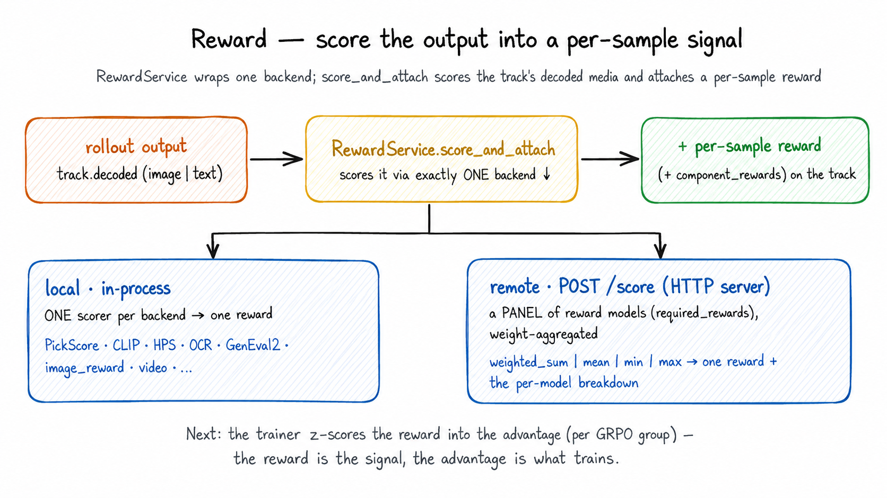

# Reward

> **Where it fits:** the *reward* step of the loop —
> rollout → **reward** → advantage → train → sync. In: the rollout engine's
> response `Sample`. Out: per-sample rewards (which the trainer turns into advantages).
> Full map: [`../README.md`](../README.md).

<div align="center">
  
</div>

*One `RewardService` wraps **one backend**: a single in-process scorer (local) or a remote HTTP server that runs and weight-aggregates a **panel** of reward models. `RewardClient` keeps the full training Sample on its producing slab and sends the service only the row-aligned request that backend consumes.*

## What it is

`unirl.reward` scores what a rollout produced — an image, a video, or text — and
writes a per-sample reward back onto the Sample's frontier Part. A `RewardService` wraps
exactly **one** `RewardBackend`: either a local in-process scorer (PickScore, HPS,
CLIP, OCR, GenEval2, math, multiple-choice, video, …) or `RemoteRewardBackend`, a
thin HTTP client for the standalone server in `unirl-reward-service/`.

Turning rewards into advantages is the trainer's job
(`Part.compute_advantages`); generating the media is the rollout engine's.

## Why it exists

RL is only as good as its reward signal, and two things about that signal are
easy to get wrong — so this module owns both:

- **One interface over many scorers.** Local or remote, image/video/text, the
  trainer always calls the same `score_and_attach(sample)` and never touches a
  backend. Swapping PickScore for a remote multi-reward server is a recipe change,
  not a code change.
- **A bad reward must stop the step, not poison it.** A single NaN, null, or
  failed inference call would silently skew a whole GRPO group's advantages. The
  service fails loud: any non-finite or missing reward raises instead of flowing
  into training.

## How it works

The trainer-facing `RewardClient.score_and_attach(sample)` (`client.py`) is a
driver-side adapter over the distributed `RewardService.score(request)`
(`service.py`). It never mutates the input Sample — it returns a fresh one whose
trajectory and condition refs are the original producer-owned objects. Per call it:

1. **Refuses precomputed rewards** — raises if the frontier Part already has
   `rewards` (actor-side scoring is the only writer).
2. **Projects the wire payload** — pairs `Sample.conditioning()` with the frontier
   primitives in a typed `RewardRequest`; segment tensors, encoded conditions,
   previews, and existing training fields never enter the reward RPC.
3. **DP-shards rows** — `RewardRequest` is a `Batch`, so each worker receives the
   same frontier-row range that its backend scores independently.
4. **Scores and fails fast** — the worker calls `backend.compute_rewards` and raises
   before DP merge if any row failed.
5. **Zeroes runaway AR traces** — when the scored Part is itself an AR generation,
   one that hit `max_new_tokens` (never terminated) gets reward 0, so training
   doesn't learn to ramble to the cap.
6. **Returns scalars only** — `RewardResponse` is merged on the driver, which
   attaches float32 CPU `rewards` + `component_rewards` to a copy of the Sample.

A backend is just `compute_rewards(request) -> RewardResponse`. Local scorers
(`local/`) subclass `LocalRewardBackend` and implement `_compute_model_rewards`;
the remote backend (`remote.py`) sends one or more bounded `POST /score` calls,
multiplexes every requested reward in each item, and derives success from the
merged response.

### Managed image scorers

`ManagedScorerProcessBackend` is the environment-isolated, rank-affine middle
ground between local and externally deployed rewards. Each reward worker launches
one scorer child with an explicit Python executable; the child inherits that
worker's single visible GPU and serves only its local prompt-tree shard over
loopback HTTP. The initial capability is deliberately limited to image and
image-edit histories.

Its config separates process ownership, scorer construction, and remote-client
semantics:

```yaml
backend:
  _target_: unirl.reward.managed_process.ManagedScorerProcessBackend
  base_device: cpu
  config:
    _target_: unirl.reward.managed_process.ManagedScorerProcessSpec
    process:
      _target_: unirl.reward.managed_process.ManagedProcessConfig
      python_executable: /venvs/reward/bin/python
      service_root: /workspace/UniRL/unirl-reward-service
    scorer:
      _target_: unirl.reward.managed_process.ManagedScorerConfig
      name: editreward
      history_kind: image_edit
      params: {device: cuda, checkpoint_path: /models/EditReward}
    client:
      _target_: unirl.reward.remote.RemoteRewardSpec
      base_url: managed://rank-affine
      required_rewards: [editreward]
      input_kind: image
      request_batch_size: 8
    gpu_residency: resident
```

`request_batch_size` bounds transport/scorer calls independently from the DP
shard size. Identity echo is required for managed children. The parent manages
GPU residency through the child's `onload`, `offload`, and `shutdown` endpoints;
`drain` remains available for explicit synchronization.

**Extending it:** a new local scorer is usually a file in `local/` subclassing
`LocalRewardBackend` (set `canonical_model_name`, implement `_load_model` +
`_compute_model_rewards`, add a `<Name>Spec`), wired in a recipe by `_target_`. A
new remote reward needs no UniRL code — add it to the server and list its name in
`RemoteRewardSpec.required_rewards`.

## Gotchas

- **A non-finite/missing reward fails the whole step, by design** — fix the scorer.
  `raise_on_failure=False` (remote only) does *not* let training continue on it: the
  backend returns zeros with `successes=[False]`, and `RewardService.score`'s fail-fast
  then raises on those flags anyway. So it can't silently zero-poison a group; leave
  it `True`.
- **Reward DP shards frontier rows, not the full Sample tree.** Conditioning has
  already been projected onto those rows, and built-in backends score rows
  independently. GRPO sibling aggregation remains a driver-side advantage concern.
- **`input_kind` must match the media** (`image`/`video`/`text`) — it picks which
  decoded key the backend sees. Remote allows only `image`/`video`; local scorers
  may be `text`.
- **`base_device` is ignored by the remote backend** (it's HTTP-only); local
  scorers honor it, falling back to CPU with a warning if CUDA is unavailable.
