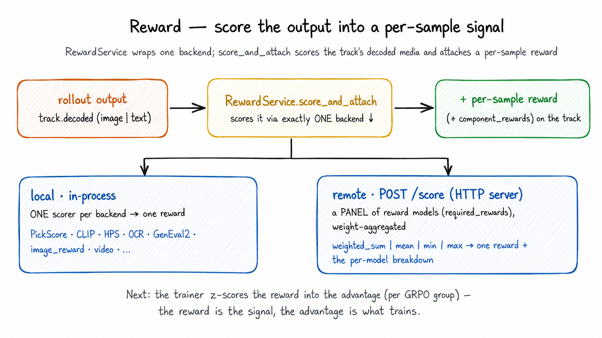

# Reward

> **Where it fits:** the *reward* step of the loop —
> rollout → **reward** → advantage → train → sync. In: the rollout engine's
> response `Sample`. Out: per-sample rewards (which the trainer turns into advantages).
> Full map: [`../README.md`](../README.md).

<div align="center">
  
</div>

*One `RewardService` wraps **one backend**: a single in-process scorer (local) or a remote HTTP server that runs and weight-aggregates a **panel** of reward models. The per-sample reward it attaches is what the trainer z-scores into the advantage.*

## What it is

`unirl.reward` scores what a rollout produced — an image, a video, or text — and
writes a per-sample reward back onto the Sample's frontier Part. A `RewardService` wraps
exactly **one** `RewardBackend`: either a local in-process scorer (PickScore, HPS,
CLIP, OCR, GenEval2, math, multiple-choice, video, …) or `RemoteRewardBackend`, a
thin HTTP client for the standalone server in `unirl-reward-service/`.

Turning rewards into advantages is the trainer's job
(`Part.compute_advantages`); generating the media is the rollout engine's.

## Local scorer registry

The canonical built-in names are the keys in
[`local/registry.py`](local/registry.py). `VideoRewardScorer` resolves its
`inner_model_name` through the registry; recipes otherwise instantiate the
listed scorer classes directly with Hydra `_target_`.

| Registry key | Input | Purpose and restrictions |
|---|---|---|
| `aesthetic` | image | Registered placeholder; model loading and scoring are not implemented. |
| `clip` | image | CLIP prompt-image similarity. |
| `geneval2` | image + evaluation questions | Local Qwen3-VL Soft-TIFA scorer; `vqa_list` comes from row metadata or a configured dataset file; rows with neither score 0. |
| `hpsv2` | image | HPS v2 prompt-image preference. |
| `hpsv3` | image | HPS v3 prompt-image preference. |
| `hpsv3pp` | image | HPSv3++ scorer; requires its source checkout/config and accepts a local or Hugging Face-hosted checkpoint. |
| `image_reward` | image | ImageReward prompt-image preference. |
| `ocr` | image | OCR similarity against the quoted target span in the prompt. |
| `pickscore` | image | PickScore prompt-image preference. |
| `videopickscore` | video | PickScore on one configured representative frame. |
| `videoclipdelta` | video + condition video | Prompt alignment minus similarity to the source video; V2V only. |
| `videoalign` | video | Vendored VideoAlign prompt-video scorer. |
| `mc_exact_match` | text + metadata | Multiple-choice answer match against `metadata.answer`; rows without it score 0 rather than raising. |
| `clap` | generated audio/video | CLAP prompt-audio alignment for T2AV output; requires the generated audio and its sample rate. |
| `imagebind` | generated audio/video | ImageBind audio/video/text alignment; noncommercial upstream license. `RewardService` rejects it for training unless `mode` is `text_video` or `all` with a positive `text_video` weight (override with `require_prompt_video: false`). |
| `t2av_composite` | generated audio/video | Weighted composition of video-capable inner scorers; rejects a mix without a positive prompt-video term. |
| `per_domain` | image + metadata | Routes rows by `metadata.domain` to configured inner scorers. |

`MathVerifyRewardScorer` (`math_verify`) and `LLMJudgeRewardScorer`
(`llm_judge`) are valid direct recipe targets but are not entries in the
built-in registry. `VideoRewardScorer` is a wrapper whose
`inner_model_name` must resolve through the registry; it is not a registry key
itself. The standalone HTTP service has a separate registry and deployment
matrix in [`../../unirl-reward-service/README.md`](../../unirl-reward-service/README.md).

## Why it exists

RL is only as good as its reward signal, and two things about that signal are
easy to get wrong — so this module owns both:

- **One interface over many scorers.** Local or remote, image/video/text, the
  trainer always calls the same `score_and_attach(sample)` and never touches a
  backend. Swapping PickScore for a remote multi-reward server is a recipe change,
  not a code change.
- **A bad reward must stop the step, not poison it.** A single NaN, null, or
  failed inference call would silently skew a whole GRPO group's advantages. The
  service fails loud: any non-finite or missing reward raises instead of flowing
  into training.

## How it works

Everything goes through one method, `RewardService.score_and_attach(sample)`
(`service.py`). It runs per DP shard (sharding the Sample by prompt-tree), so it
never mutates the input Sample — it returns a fresh one. Per call it:

1. **Refuses precomputed rewards** — raises if the frontier Part already has
   `rewards` (actor-side scoring is the only writer).
2. **Builds the request** — pairs the frontier's generated media with its aligned
   prompts and non-text conditioning.
3. **Scores** — hands a typed `RewardRequest` to `backend.compute_rewards`, getting
   back rewards, per-component rewards, and per-sample success flags.
4. **Fails fast** — raises and names the sample if any failed.
5. **Applies the AR truncation policy** — only when the scored Part is a
   variable-length AR generation (fixed-length AR media such as Janus-Pro image
   tokens always reaches `max_new_tokens` and keeps its reward).
   `truncated_reward: zero` (default) assigns reward 0 to a trace that hit
   `max_new_tokens`, `keep` preserves the scorer result, and `soft` adds a
   penalty that grows linearly over the last `overlong_buffer_len` tokens,
   scaled by `overlong_penalty_factor`.
6. **Attaches** `rewards` + `component_rewards` and returns the Sample.

A backend is just `compute_rewards(request) -> RewardResponse`. Local scorers
(`local/`) subclass `LocalRewardBackend` and implement `_compute_model_rewards`;
the remote backend (`remote.py`) sends one or more bounded `POST /score` calls,
multiplexes every requested reward in each item, and derives success from the
merged response.

### Micro-batching the rollout so a remote reward overlaps generation

`RewardStack` (`stack.py`) is an optional role for the diffusion training path, built
beside the rollout engine on the same Worker. Given one DP shard it slices the frontier
Part into micros of `micro_batch_size` rows, generates
and scores each micro in-process through its rollout and reward siblings, and
concatenates the scored Parts back into one Sample. The driver then skips
`_reward_phase()`.

```yaml
reward_stack:
  _target_: unirl.reward.stack.RewardStack
  micro_batch_size: 8      # rows per micro; a micro can be one row unless the engine packs whole groups
  overlap: false           # true: score each micro on a thread while the next ones generate
```

A micro can be as small as one row. The exception is an engine that packs a whole
`samples_per_prompt` group into one request (the vLLM-Omni t2i adapters: SD3, Qwen-Image
and BAGEL t2i), which the engine reports through `packs_groups(sample)`; there a micro is
extended to the end of the group it would otherwise split, so the group is the floor.
BAGEL it2i, SGLang and the trainside engine take micros of any size.

It pays for a reward that costs real time relative to generation, which in practice
means one served from other GPUs: colocated with PickScore the stack recovers 0.15 s of a
108.8 s step. Measured with one 8-GPU training node (BAGEL it2i, 256 rows per rollout,
4 micros per rank) and EditScore behind `reward_service.direct_server` on another node,
the serial micro loop takes generate+reward from 127.5 s to 111.6 s with an 8B judge and
from 180.1 s to 144.7 s with a 72B one. Two things change: each rank's micros reach the
scorer as they finish instead of every rank arriving together after the whole shard, and
the driver's scoring dispatch round trip disappears; making the POSTs smaller on its own
(`RemoteRewardSpec.request_batch_size`) is slower than the baseline on all three judges.

`overlap: true` runs the scoring calls on one thread in micro order and generation never
waits for a score. It adds to the serial loop only while the scorer has headroom (8B:
111.6 s to 106.8 s); a saturated scorer (72B) bounds the step by its throughput however
the calls are scheduled. A scorer that fails raises after the next micro generates.

The BAGEL it2i times above predate #547: the vLLM-Omni rollout then ran upstream's own
img2img prefill (a 4902-token ViT prefix at 512x512) instead of the trainside contexts
(1227 tokens), and it2i generation has taken about a quarter less time since. They have
not been re-measured.

Once the shard has left the worker the driver has the stack collect garbage (the memory
monitor's `gc.collect` + `empty_cache` loop): the micro loop leaves enough Python garbage
behind that the next train phase otherwise ran 5-8% slower, 191.8 s against 177.5 s with
the remote judge and 59.5 s against 54.3 s with local PickScore, both now below the
no-stack path; `gc.collect` alone recovers it, `empty_cache` alone does not. The driver logs each rollout's
per-rank split (`reward stack timing: ... generate_s=<max>/<mean> score_s=... wall_s=...`)
and adds `stack_generate` / `stack_score` to the perf phases; the driver-side `generate`
and `reward` timers do not fire under the stack.

### Managed image scorers

`ManagedScorerProcessBackend` is the environment-isolated, rank-affine middle
ground between local and externally deployed rewards. Each reward worker launches
one scorer child with an explicit Python executable; the child inherits that
worker's single visible GPU and serves only its local prompt-tree shard over
loopback HTTP. The initial capability is deliberately limited to image and
image-edit histories.

Its config separates process ownership, scorer construction, and remote-client
semantics:

```yaml
backend:
  _target_: unirl.reward.managed_process.ManagedScorerProcessBackend
  base_device: cpu
  config:
    _target_: unirl.reward.managed_process.ManagedScorerProcessSpec
    process:
      _target_: unirl.reward.managed_process.ManagedProcessConfig
      python_executable: /venvs/reward/bin/python
      service_root: /workspace/UniRL/unirl-reward-service
    scorer:
      _target_: unirl.reward.managed_process.ManagedScorerConfig
      name: editreward
      history_kind: image_edit
      params: {device: cuda, checkpoint_path: /models/EditReward}
    client:
      _target_: unirl.reward.remote.RemoteRewardSpec
      base_url: managed://rank-affine
      required_rewards: [editreward]
      input_kind: image
      request_batch_size: 8
    gpu_residency: resident
```

`request_batch_size` bounds transport/scorer calls independently from the DP
shard size. Identity echo is required for managed children. The parent manages
GPU residency through the child's `onload`, `offload`, and `shutdown` endpoints;
`drain` remains available for explicit synchronization.

**Extending it:** a new local scorer is usually a file in `local/` subclassing
`LocalRewardBackend` (set `canonical_model_name`, implement `_load_model` +
`_compute_model_rewards`, add a `<Name>Spec`), wired in a recipe by `_target_`. A
new remote reward needs no UniRL code — add it to the server and list its name in
`RemoteRewardSpec.required_rewards`.

## Gotchas

- **`reward_stack:` is colocate-only and DP-only** — the trainer rejects `layout:
  separate`, `reward_fraction > 0`, `reward_resident: false`, `sp_size > 1` and
  `tp_size > 1`: the stack needs the engine and the reward as in-process siblings, it
  scores inside the rollout residency window (a local GPU scorer shares its peak with
  the awake engine, and the trainer stays parked through scoring under
  `train_resident: false`), and every rank of an SP or TP group would score the same
  shard or hand the stack nothing. The engine's own chunk loop goes inert, including
  `sglang_diffusion`'s per-chunk `empty_cache`; set `micro_batch_size` to
  `rollout.forward_batch_size` to keep the trainside engine's chunk boundaries and its
  per-step SDE noise draw order.
- **No scorer that draws from the global RNG may run under `overlap: true`** — SD3's
  per-step SDE noise comes from the shared global CUDA generator (`sde/kernels.py:300`,
  `generator=None`), so a scorer drawing on the scoring thread interleaves with the
  sampler's draws in an unspecified order and makes the rollout itself
  nondeterministic. PickScore, CLIP and HPS draw nothing; a sampling in-process LLM
  judge or a diffusion-based scorer does, so keep those on `overlap: false`. A
  colocated GPU scorer also shares the default CUDA stream with generation, so only its
  CPU-side work overlaps; the thread pays off for a remote scorer.
- **A non-finite/missing reward fails the whole step, by design** — fix the scorer.
  `raise_on_failure=False` (remote only) does *not* let training continue on it: the
  backend returns zeros with `successes=[False]`, and `score_and_attach`'s fail-fast
  then raises on those flags anyway. So it can't silently zero-poison a group; leave
  it `True`.
- **`input_kind` must match the media** (`image`/`video`/`text`) — it picks which
  decoded key the backend sees. Remote allows only `image`/`video`; local scorers
  may be `text`.
- **`math_verify` grades each batch in a `forkserver` child.** Its
  `signal.alarm` timeouts require the main thread, which threaded Ray actors do not
  provide. The forkserver preloads `math_verify` and the scorer module, avoiding
  repeated imports without inheriting the worker's threaded process state. The parent
  waits on both the result pipe and child sentinel; keep `proc.start()` inside the
  cleanup boundary so startup failures also release resources. Per-operation timeout
  is `UNIRL_MATHVERIFY_TIMEOUT_S` (default 10s), with a hard batch cap of
  `3 * timeout * jobs + 60s`. Wrong or unparsable answers return 0.0, while child,
  IPC, and batch-timeout failures raise. Teardown uses `SIGKILL` plus a bounded join;
  do not replace it with `multiprocessing.Pool.terminate()`, whose worker join is
  unbounded.
- **`base_device` is ignored by the remote backend** (it's HTTP-only); local
  scorers honor it, falling back to CPU with a warning if CUDA is unavailable.
- **Prompt-based rewards use the generation prompt by default.** Set
  `prompt_source: original` to score against the original user prompt instead.
- **A training `reward:` must relate the prompt to the video.** `RewardService`
  rejects a backend whose `covers_prompt_video()` is false — e.g. imagebind
  `mode: audio_video`, which scores generated audio against generated video and is
  maximised by collapsing both. `eval_rewards` suites are exempt, so such a score
  can still be measured there; set `require_prompt_video: false` to train on it anyway.
