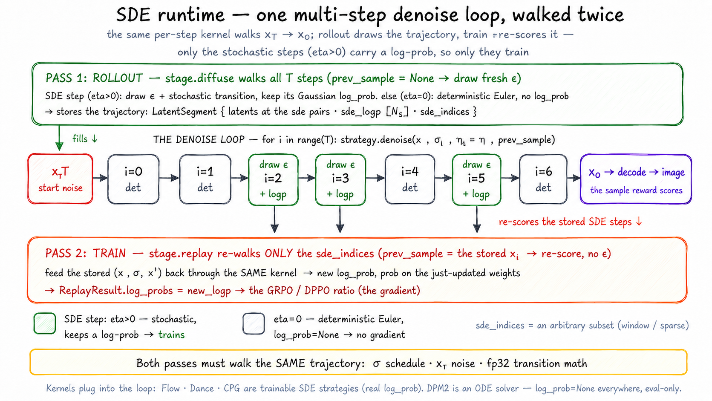

# SDE runtime

> **Where it fits:** cross-cutting — shared by *rollout* and train-side *replay*
> for the σ schedule, start noise, and stochastic transition density. The
> deterministic solver is a model-config-owned contract, not an engine choice.
> Full map: [`../README.md`](../README.md).

  0 SDE steps while the rest stay deterministic, and stores the trajectory; train (replay) re-walks only those SDE steps, feeding the stored transitions back through the same kernel to get new log-probs for the GRPO/FlowDPPO ratio" width="100%">

*One `strategy.denoise()` per step. **Sampling** vs **replay** is the
`prev_sample` argument; the rollout's selected indices use an SDE kernel, while
the remaining deterministic indices run the model config's declared solver
(UniPC for WAN via FastVideo) or the trainside `eta=0` Euler collapse.*

## What it is

`unirl.sde` owns shared per-step diffusion math: the stochastic **kernels**
replayed during training (Flow / Dance / CPS), deterministic solvers (DPM2 /
UniPC), the FlowMatch **σ schedule** policy (with a per-model μ override), the
**SDE-index schedule** that picks which steps are stochastic, and the
deterministic **initial-noise (`x_T`) recipe**.

## Why it exists

The policy-gradient ratio is only meaningful when train-side replay scores each
stored stochastic transition with the same σ, model conditioning, and SDE
density used during rollout — so the σ schedule, the start noise `x_T`, and the
SDE transition math stay bit-identical across every engine, non-negotiably.
The deterministic non-SDE solver shapes which trajectory gets sampled but never
enters the ratio; it is declared by the model config
(`WAN21PipelineConfig.unipc_*`), and an adapter either implements it, verifying
the checkpoint scheduler agrees (FastVideo), or still runs the `eta=0` Euler
collapse (trainside, SGLang, vLLM-Omni) — a tracked divergence, not an
adapter's private choice.

## How it works

- **One SDE kernel, two modes.** Each model's diffusion stage calls
  `strategy.denoise(...)` once per step. For stochastic kernels,
  `prev_sample=None` means *sampling* (draw fresh noise); passing a `prev_sample`
  means *replay* (score the given transition, no noise drawn). Those two modes
  share the exact transition code. The math runs in fp32 (σ forced to fp32 to
  match SGLang).
- **SDE indices own the policy-gradient density.** The selection is a
  `TimestepScheduler` (`index_schedule.py`) wired under `sampling.scheduler`, which
  `DiffusionSamplingParams.resolve_sde_indices` asks once per rollout id. Selected
  `sde_indices` get a stochastic transition with a real per-step Gaussian log-prob
  (→ `LatentSegment.sde_logp`). Trainside loops collapse the same SDE kernel to
  Euler with `eta=0`; the FastVideo adapter instead implements the model
  config's declared UniPC solver on non-SDE indices, verifying the checkpoint
  scheduler against the spec (`rollout/engine/fastvideo/README.md`). UniPC
  keeps model-output
  history across consecutive ODE steps and clears it after an intervening SDE
  jump before warming up from first order again.
- **The σ schedule** comes from `FlowMatchSchedulePolicy` (`runtime.py`), loaded
  once per actor from the checkpoint JSON (no weights). Static schedules apply the
  SD3 time-shift locally (to dodge diffusers' double-shift bug #13243); dynamic
  schedules derive μ from `(H, W)` — `compute_mu` is the single per-model override
  point (FLUX.2-klein subclasses it). `ensure_sample_sigmas(sample, policy)` pins the
  result onto the diffusion Part's `sampling_params.sigmas` in every diffusion engine, so
  every backend samples on the exact schedule the trainer will replay (AR-only
  paths skip it).
- **The `x_T` recipe** (`noise.py`). The driver doesn't ship the noise tensor — it
  ships a recipe (per-sample group ids + latent shape). Each engine calls
  `regen_initial_noise(...)`, which draws on **CPU in fp32** with a per-group seeded
  generator, then casts to device. CPU randn is bit-stable across machines, so every
  engine starts each rollout from byte-identical noise.

**Extending it:** a new kernel subclasses `SDEStrategy` (or `StepStrategy` for a
deterministic ODE solver), wired under `pipeline.strategy` or an engine adapter. A
per-model σ override subclasses `FlowMatchSchedulePolicy` and overrides only
`compute_mu`. A new SDE-index schedule subclasses `TimestepScheduler`
(`index_schedule.py`), wired under `sampling.scheduler`. DanceGRPO/MixGRPO
add no kernel: DanceGRPO swaps in `DanceSDEStrategy` under `pipeline.strategy`,
MixGRPO keeps `FlowSDEStrategy` and adds a `WindowScheduler` under
`sampling.scheduler`.

## Gotchas

- **`DPM2Strategy` can't train** — it returns `log_prob=None` everywhere, so
  GRPO/FlowDPPO have no ratio. Eval-only, and stateful (needs `init_schedule`/`reset`).
- **`UniPCStrategy` is deterministic and stateful** — it also returns
  `log_prob=None`, requires `init_schedule`, and only reuses history across
  consecutive ODE indices. An SDE jump must reset its history. Its `UniPCSpec`
  comes from the model config, never from the engine; adapters verify the
  checkpoint scheduler matches before stepping.
- **σ silently arrives as float64** — `torch.linspace` (the static-σ branch) defaults
  to float64, so without `denoise`'s `.float()` cast the transition computes in float64
  while SGLang uses float32; the `1/(2σ²)` term amplifies the gap into the replayed
  log-prob and skews the ratio.
- **By default only `x_T` is reproducible, not the per-step SDE noise** —
  `denoise(..., generator=None)` preserves the historical engine-local RNG
  behaviour, and replay re-scores the stored `prev_sample` instead of re-drawing
  it. A model or rollout engine may opt into stricter end-to-end reproducibility
  by passing request-local, sample-unique generators; never reset one shared
  generator to the same seed for every GRPO sample, which freezes exploration.
- **`initial_latents` wins over the recipe** — a shipped latent (img2img / i2v
  first frame) is used verbatim; the recipe only fills the t2i `x_T`.
- **Don't "simplify" the static-σ branch to call diffusers** — it exists to avoid
  the double-shift bug (#13243) and is tagged `DELETE-WHEN` for when upstream is
  fixed.
- **`transition_std` and `step`'s `std_var` must stay equal** — `transition_std` is
  the normalizer for the FlowDPPO KL `(Δmean)²/(2·std²)`, and both derive from the
  same `_std_dev_t` (a pure function of schedule + `eta`, independent of model
  output). Splitting them silently desyncs the KL from the transition. `CPSStrategy`
  overrides `transition_std` deliberately: its noise carries no `sqrt(-dt)` factor.
- **The dtype round-trip in `_finalize_logp` is not a no-op cast.** It simulates
  trajectory *storage* precision so replay-time log-prob matches sampling-time
  log-prob. Delete it as dead code and the ratio drifts. Skipped for `eta<1e-7`.
- **`ensure_sample_sigmas` takes height/width/steps with no defaults, on purpose** —
  a silent `1024×1024` mis-derives μ for dynamic-shift models rendering at anything
  else (e.g. WAN T2V at 480×832).
- **`shift_terminal` is truthiness-gated by diffusers**, so `0` / `0.0` means
  *disabled*, not "stretch to zero" — normalize falsy values to `None`.
- **`compute_mu` is the single per-model μ override point.** FLUX.2-klein's μ depends
  on **both** `image_seq_len` and `num_inference_steps`, unlike the base formula.
